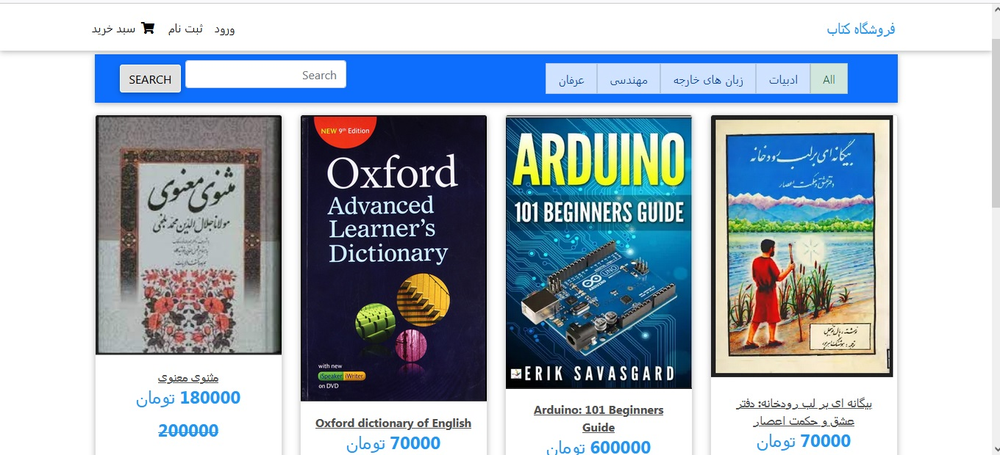
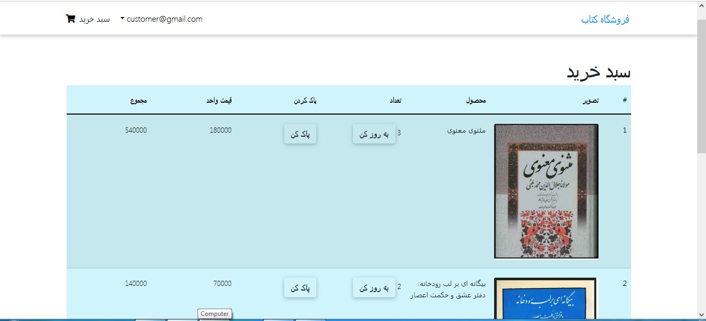
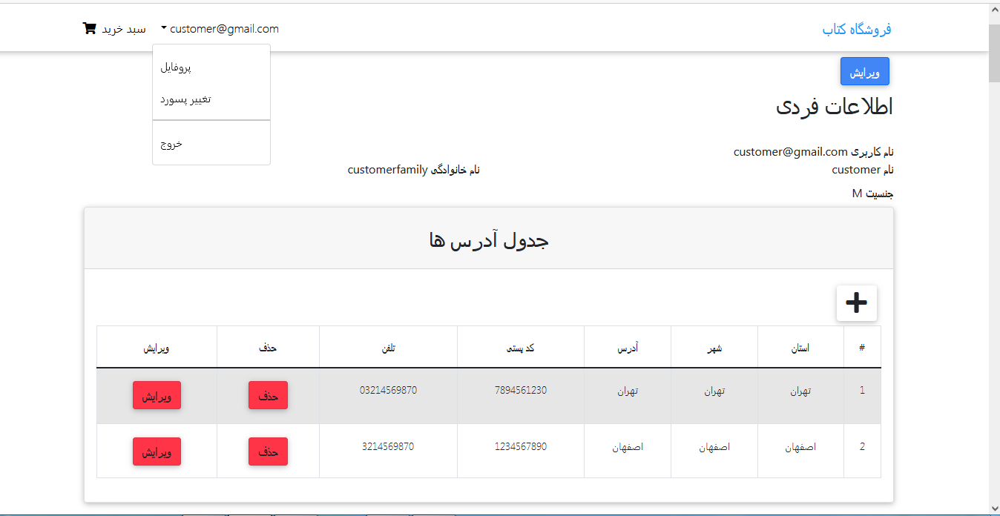
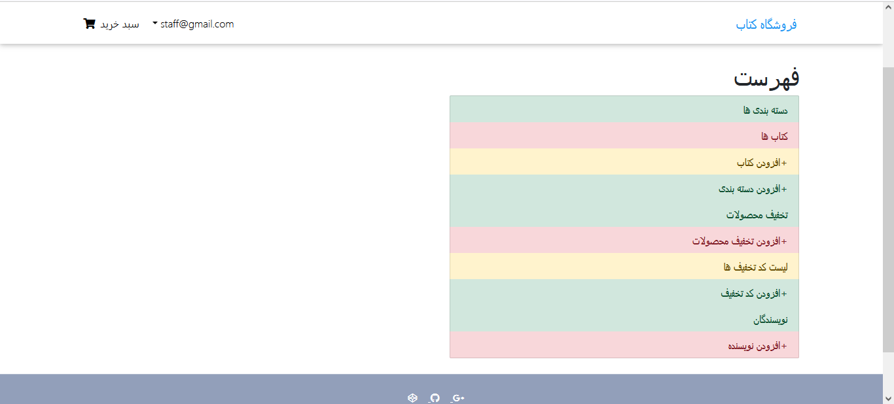
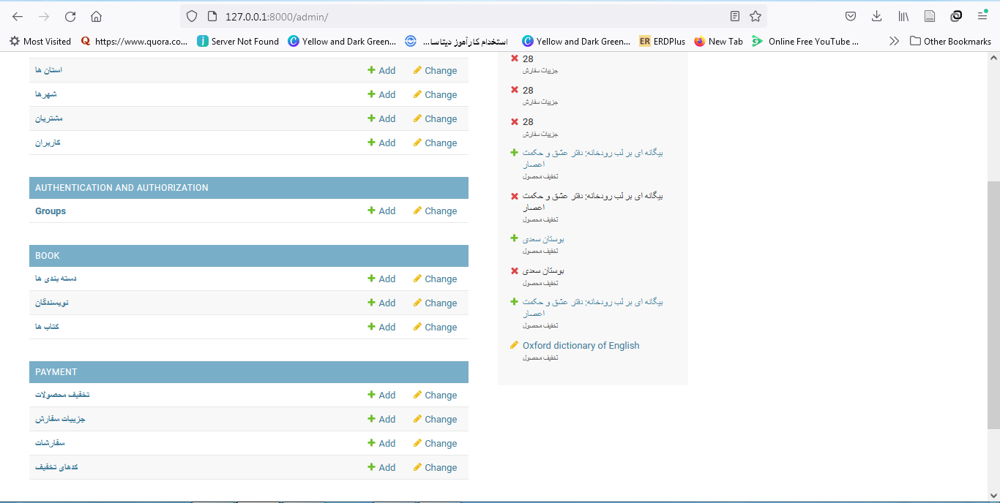

# کتاب فروشی
این پروژه یک سایت کتاب فروشی به شرح زیر .میباشد

افراد می توانند لیست کتاب ها را مشاهده کرده و اقدام به خرید کنند. همچنین دسته بندی های مختلف برای کتاب ها وجود دارد که میتوانند فقط در همان دسته به جستجوی کتاب مورد نظر خود پرداخته و آن را انتخاب نمایند. کالاهای خریداری شده در سبد خرید آن ها ثبت می شود و اگر بعدا نیز مراجعه کنند، اطلاعات سبد خرید آن ها موجود است.نمایی از سبد خرید در تصویر زیر آمده است.
 
 
برای ذخیره اطلاعات از کوکی استفاده شده است. کاربران برای ثبت سفارش سبد خرید خود باید در سایت ثبت نام نمایند. 
هر کاربر برای خود یک حساب کاربری دارد .مشتری میتواند آن ها را ویرایش کند. همچنین آدرس های مختلف برای ارسال اقلام خریداری شده داشته باشد. کاربران در حساب کاربری خود قادر به مشاهده تاریخچه سفارشات خود هستند. نمایی از حساب کاربری افراد در تصویر زیر قابل مشاهده است.

در این سایت سه نقش مشتری، کارمند و مدیر وجود دارد. کارمندان در حساب کاربری خود امکاناتی از قبیل افزودن کتاب یا دسته، کد تخفیف و ... دارند. در تصویر زیر این امکانات به نمایش در امده است.

صفحه ادمین نیز کاستوم سازی شده است. نمایی از آن در شکل زیر نمایش داده شده است.

در این پروژه دو نوع تخفیف وجود دارد. هر کتاب میتواند تخفیف داشته باشد و همچنین کدهای تخیف برای سفارشات قابل اعمال است. هر کد تخفیف دارای زمان انقضا است و زمانی برای فاکتور اعمال میشود که تاریخ سفارش آن در بازه تعریف شده برای آن کد باشد.